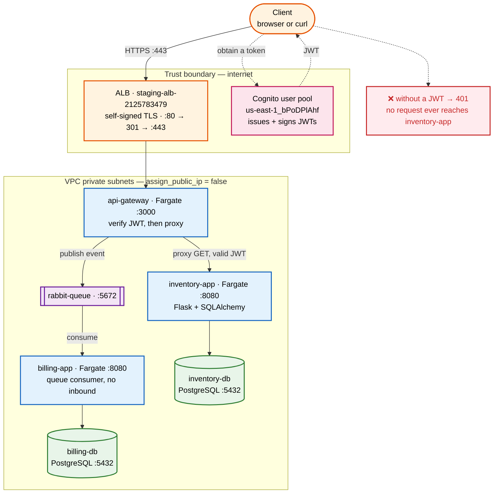
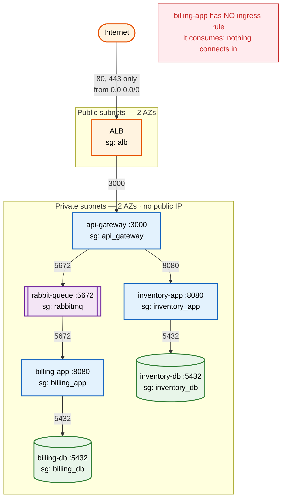
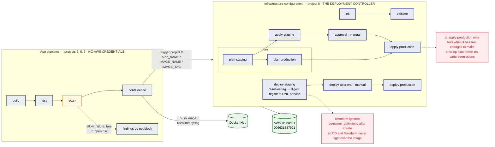
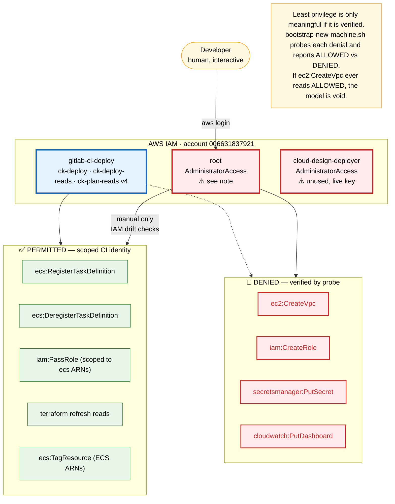
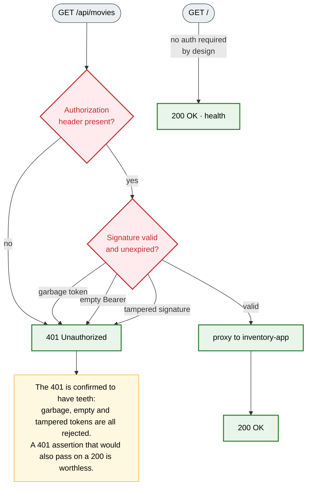
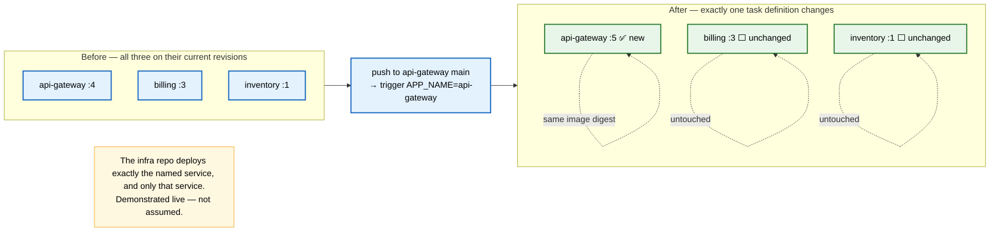
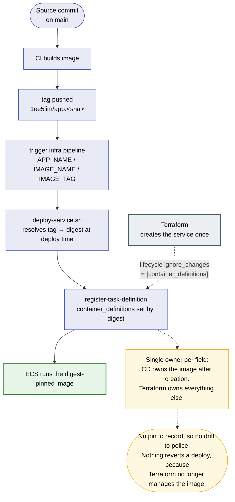
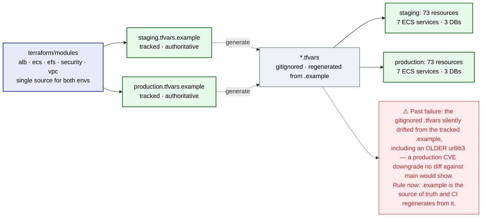

# Architecture Diagrams

Colour-coded Mermaid diagrams for audit review. Every diagram is drawn from the Terraform source and
the live infrastructure, not from the prose docs — where they disagree, the code wins.

**Legend** is consistent across all diagrams:

| Colour | Meaning |
|---|---|
| 🟠 amber | Internet-facing / trust boundary edge |
| 🟡 yellow | Public subnet |
| 🔵 blue | Private subnet compute (no public IP) |
| 🟢 green | Persistent data store |
| 🟣 purple | Message queue |
| 🔴 pink | Identity / authentication |
| ⚪ grey | CI/CD control plane |
| 🔴 red | Explicitly denied |

---

## 1. Runtime request flow

What a request actually does, end to end. The dashed red edge is the security control that matters
most: `api-gateway` refuses an unauthenticated call before it ever touches `inventory-app`.



**The billing path is asynchronous.** `POST /api/billing/` returns as soon as the event is on the
queue; `billing-app` writes to `billing-db` afterwards. A 200 from that endpoint proves the publish
worked, not that the write completed.

---

## 2. Network trust boundaries

Only the ALB is reachable from the internet. Every service-to-service hop is permitted by **security
group reference**, not by CIDR — so the rules survive IP changes and cannot be satisfied by an
unexpected source address.



### Ingress matrix — the complete list

| Security group | Port | Permitted source |
|---|---|---|
| `alb` | 80 | `0.0.0.0/0` |
| `alb` | 443 | `0.0.0.0/0` |
| `api_gateway` | 3000 | **sg:alb** |
| `inventory_app` | 8080 | **sg:api_gateway** |
| `inventory_db` | 5432 | **sg:inventory_app** |
| `rabbitmq` | 5672 | **sg:api_gateway, sg:billing_app** |
| `billing_db` | 5432 | **sg:billing_app** |
| `billing_app` | — | *no ingress rule at all* |

That is every ingress rule in the stack. Six hops, each referencing the previous security group. An
auditor should confirm this list is reproduced exactly by
`terraform plan` — any additional rule is a finding.

---

## 3. CI/CD control plane

The central design rule: **app pipelines hold no AWS credentials.** They build and push an image,
then *trigger* the infrastructure repo. Only the infra repo can change AWS.



### Three things an auditor will ask about

**`scan` is `allow_failure: true`.** Two HIGH CVEs shipped inside a green pipeline on 2026-09-30.
Findings are reported but do not fail the build. This is a known, open decision.

**`apply-production` is not reliably red.** The CI identity cannot *provision* in production, so an
apply with real changes to make fails on `AccessDenied`. But an apply whose plan is **empty** needs
no write permissions at all, and succeeds. Expect this job to go green on a no-op plan. That is not
evidence the identity can write to production — verify with the `ec2:CreateVpc` probe below, not by
reading this job's colour.

---

## 4. Identity model — who can do what

The audit-defining diagram. One scoped identity deploys; it cannot provision.



### ⚠️ Two identities that will be raised

| Identity | Status | Required action |
|---|---|---|
| `root` | Account owner. Used for IAM drift checks only. | Expected. |
| `cloud-design-deployer` | **`AdministratorAccess` + an active access key**, created 2026-09-11 by an earlier bootstrap script. **Not used by Code-Keeper.** Last CloudTrail activity 2026-09-17. | **Not deleted** — deletion is destructive and it may be wanted as evidence. Recommended: revoke the key **first**, then the user, so there is never a window with neither. |

The related script `bootstrap-iam.sh` defaulted to `POLICY_MODE=admin` and attached
`AdministratorAccess` when run bare. The default is now `scoped`, and `admin` requires typing
`yes-i-understand`.

> **Near-miss worth recording:** that fix was committed only to the GitHub mirror while GitLab was
> unreachable, then destroyed locally by `git reset --hard origin/main`. For a period the
> authoritative remote still shipped the dangerous default. It was found only by diffing
> `github/main` against `origin/main`. **A security fix that cannot be pushed to the authoritative
> remote has not been made.**

---

## 5. Authentication decision

The control that the audit will test, and the one with a documented proof that it has teeth.



Reproduce with `scripts/test-api-as-user.sh`, which asserts all four cases and exits non-zero on
failure.

---

## 6. Deployment isolation

The property that makes the trigger design safe: deploying one service must not disturb the others.



---

## 7. Who owns the container image

CD owns the image. Terraform creates the service and then **ignores** `container_definitions`
afterwards, so the two can no longer fight over it.

This replaces the earlier digest-pinning scheme (`pin-image.sh` + `check-image-pins.sh`), which is
removed. Those two scripts failed repeatedly — `diff` missing from the CI image, `git` missing from
it, and a `terraform apply` reverting a deploy so the recorded pin became a rollback made to look
intentional. Moving ownership to one actor removed the conflict instead of policing it.



The digest is still resolved from the registry and written into the task definition, so a running task
is always pinned to immutable bytes. What is gone is the second writer that used to overwrite it.

**Chain of custody for auditors:** every running task definition names an immutable `@sha256`
digest, and `deploy-service.sh` records the resolved digest and asserts the service actually runs it
before the job is allowed to succeed. To verify, read the task definition directly:

```bash
aws ecs describe-services --cluster staging-cluster \
  --services staging-inventory-service \
  --query 'services[0].taskDefinition' --output text
```

There is deliberately no tracked file to compare it against. The earlier pin comparison is gone, so
the task definition itself is the record.

---

## 8. Environment parity

`staging` and `production` are built from the **same modules**. There is no environment-specific
Terraform code — the difference is entirely in `environments/*.tfvars.example`.



---

## Audit checklist

Each item is reproducible with a command, so the audit does not depend on a human assertion.

| # | Claim | How to verify |
|---|---|---|
| 1 | Both environments match their configuration | `terraform plan` → `No changes` |
| 2 | State is the shared state, not an empty one | `terraform state list \| wc -l` → **73** |
| 3 | ALB identity is correct | `terraform state show module.alb.aws_lb.main` → expected `name` |
| 4 | Every running image is digest-pinned | `aws ecs describe-task-definition` → image ends `@sha256:` |
| 5 | CI identity cannot provision | `aws ec2 create-vpc --profile code-keeper` → **DENIED** |
| 6 | CI identity is not root | `aws sts get-caller-identity --profile code-keeper` → `…:user/gitlab-ci-deploy` |
| 7 | IAM matches the repo | `./scripts/bootstrap-new-machine.sh --verify-only` → three policies `match` |
| 8 | Auth is enforced, not decorative | `scripts/test-api-as-user.sh` → 401 then 200, 4/4 |
| 9 | Deploys are isolated | observe one service revision moves, others do not |
| 10 | Terraform is pinned | `terraform version` → exactly **1.10.5**, same as CI |
| 11 | Terraform will not revert a CD deploy | `terraform plan` after a deploy proposes **no** image change |

Run item 7 first. It is the cheapest check that covers the most, and it reports drift rather than
asserting absence.

---

*Diagrams generated from `infrastructure-configuration/terraform` and verified against live AWS on
2026-10-02. Regenerate if the modules change.*